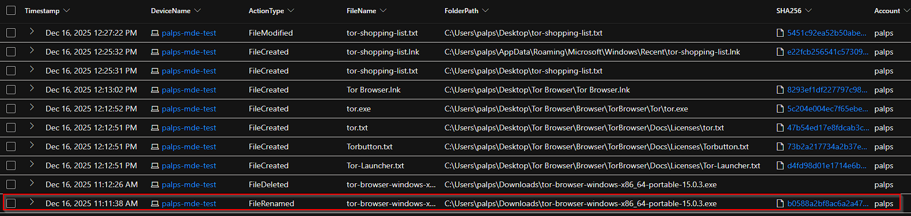

# ThreatHunt Final Project


# Threat Hunt Report: Unauthorized TOR Usage

**Detection of Unauthorized TOR Browser Installation and Use on workstaion: Palps-MDE-test**

[Threat Event Scenario Creation](https://github.com/ElRoiP/CyberPortfolio/blob/main/ThreatHunt%20Final%20Project/Threat%20Event%20Scenario.md)

## Platforms and Languages Leveraged:
- Windows 10 Virtual Machines (Microsoft Azure)
- EDR Platform: Microsoft Defender for Endpoint
- Kusto Query Language (KQL)
- Tor Browser

## Scenario:

Management suspects that some employees may be using TOR browsers to bypass network security controls because recent network logs show unusual encrypted traffic patterns and connections to known TOR entry nodes. Additionally, there have been anonymous reports of employees discussing ways to access restricted sites during work hours. The goal is to detect any TOR usage and analyze related security incidents to mitigate potential risks.

---

## High-Level TOR related IoC Discovery Plan:

1. Check `DeviceFileEvents` for any tor(.exe) or firefox(.exe) file events
2. Check `DeviceProcessEvents` for any signs of installation or usage
3. Check `DeviceNetworkEvents` for any signs of outgoing connections over known TOR ports

---

## Steps Taken:

1. Searched `DeviceFileEvents` table for any file that had the string “tor” in it and discovered  that the user `palps` has downloaded a tor installer, which triggered a series of tor-related files in the desktop which includes a file called `tor-shopping-list.txt`on `2025-12-16T17:25:32.2986722Z`. These events began at `2025-12-16T16:11:38.353237Z` .
Query used to locate events:
    
    ```kql
    DeviceFileEvents
    | where DeviceName == "palps-mde-test"
    | where FileName startswith "tor"
    | where InitiatingProcessAccountName == "palps"
    | where Timestamp >= datetime(2025-12-16T16:11:38.353237Z)
    | order by Timestamp desc 
    | project Timestamp, DeviceName, ActionType, FileName, FolderPath, SHA256, Account = InitiatingProcessAccountName
    ```
    
    
    
2. Searched the `DeviceProcessEvents` table for any `ProcessCommandLine` that contained the string `tor-browser-windows-x86_64-portable-15.0.3.exe` . Based in the logs returned at `2025-12-16T17:12:29.2835373Z` , the user `palps` on the `palps-mde-test` device ran the file executed the command to silently install the file.
Query to locate events:
    
    ```kql
    DeviceProcessEvents
    | where DeviceName == "palps-mde-test"
    | where ProcessCommandLine contains "tor-browser-windows-x86_64-portable-15.0.3.exe"
    | project Timestamp, DeviceName, AccountName, ActionType, FileName, ProcessCommandLine
    ```
    
    
    
3. Searched the `DeviceProcessEvents` table for any indication that the user `palps` has launched the the tor browser. Evidence from the logs indicates that they have launcehd an instance of `tor.exe` on`2025-12-16T17:16:21.0596319Z` and `firefox.exe` (tor) on `2025-12-16T17:16:12.0828789Z` 
Query to locate events:
    
    ```kql
    DeviceProcessEvents
    | where DeviceName == "palps-mde-test"
    | where ProcessCommandLine has_any("tor.exe","firefox.exe")
    | project  Timestamp, DeviceName, AccountName, ActionType, SHA256, ProcessCommandLine
    ```
    
    
    
4. Searched the `DeviceNetworkEvents` table for any indication the tor browser was used to establish any connection using any of the known tor ports. Logs show that the user has successfully connected on `2025-12-16T17:17:23.7586533Z` to the remote IP address `162.220.14.54` on port `9001` initiated by `tor.exe`. There were other multiple remote IPs the user has successfully connected to afterwards.
Query to locate events:
    
    ```kql
    DeviceNetworkEvents
    | where DeviceName == "palps-mde-test"
    | where InitiatingProcessFileName in~ ("tor.exe", "firefox.exe")
    | where RemotePort in (9001, 9030, 9040, 9050, 9051, 9150)
    | project Timestamp, DeviceName, InitiatingProcessAccountName, ActionType, InitiatingProcessFileName, RemoteIP, RemotePort, RemoteUrl
    | order by Timestamp desc
    ```
    
    
    
5. Search the `DeviceFileEvents` table if any files were created while user was browsing via tor and logs show that a `tor-shopping-list.txt` was created and modified on `2025-12-16T17:25:31.9864719Z`. 
Query to locate events:
    
    ```kql
    DeviceFileEvents
    | where FileName contains "shopping-list.txt"
    | order by Timestamp desc 
    | project Timestamp, DeviceName, FileName, ActionType, FolderPath
    ```
    
    
    

---

## Chronological Events:

### 1. Tor Files Downloaded

**2025-12-16 16:11:38 UTC**

DeviceFileEvents telemetry shows the user `palps` downloaded a Tor installer. Multiple Tor-related files appeared on the desktop shortly after, including `tor-shopping-list.txt`, indicating early user interaction with Tor-related content.

### 2. Tor Browser Installed

**2025-12-16 17:12:29 UTC**

DeviceProcessEvents confirms execution of `tor-browser-windows-x86_64-portable-15.0.3.exe` using a silent installation command. The installer was run by user `palps` on the endpoint.

### 3. Tor Browser Launched

**2025-12-16 17:16:12–17:16:21 UTC**

Process telemetry shows execution of `firefox.exe` (Tor Browser frontend) followed by `tor.exe`, confirming the Tor Browser was successfully launched.

### 4. Tor Network Connections Established

**2025-12-16 17:17:23 UTC and onward**

DeviceNetworkEvents records successful outbound connections initiated by `tor.exe` to multiple remote IP addresses using known Tor ports (e.g., 9001), confirming active Tor network usage.

### 5. File Created During Tor Session

**2025-12-16 17:25:31 UTC**

While Tor was in use, DeviceFileEvents shows the file `tor-shopping-list.txt` was created and modified, indicating user activity concurrent with Tor browsing.

---

## Summary:

- Tor Browser was downloaded, silently installed, launched, and actively used.
- The endpoint established multiple connections to the Tor network.
- User file activity occurred during the Tor browsing session.

**Conclusion:**

This investigation confirms intentional and active Tor Browser usage by user `palps` on `palps-mde-test`. Further response should align with organizational policy regarding anonymization tools and acceptable use.

---

## Response Taken:

TOR usage was confirmed on endpoint `palps-mde-test` by the user `palps`. The device was isolated and the user’s direct manager was notified.

---

## Created By:

- **Author Name**: El Roi Pablo
- **Author Contact**: [https://www.linkedin.com/in/elroipablo/](https://www.linkedin.com/in/elroipablo/)
- **Date**: December 16, 2025

## Revision History:

| **Version** | **Changes** | **Date** | **Modified By** |
| --- | --- | --- | --- |
| 1.0 | Initial draft | `December  16, 2025` | `El Roi Pablo` |
